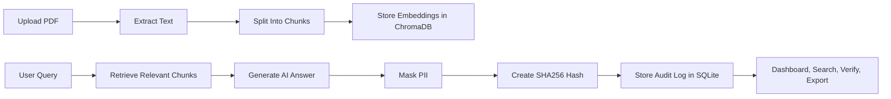

# RAGTrace: AI Audit Trail Middleware for RAG Systems

RAGTrace is a full-stack project I built to make Retrieval-Augmented Generation systems more transparent, traceable, and audit-friendly. In most RAG applications, users only see the final AI answer, but teams often need to know which question was asked, which document chunks were retrieved, what response was generated, when it happened, and whether the record was changed later.

This project solves that problem by creating an audit trail around every AI response. Each interaction is logged with the user query, retrieved sources, model response, timestamp, model name, and a SHA256 verification hash.

## Project Screenshot


<!-- Save the working dashboard screenshot at docs/screenshots/ragtrace-dashboard.png -->

## Why I Built This Project

AI systems are increasingly used with private company documents, policies, research papers, legal files, and internal knowledge bases. However, a normal chatbot does not clearly show how an answer was produced. This creates problems for debugging, compliance, trust, and accountability.

I built RAGTrace to explore how an AI system can become more explainable by storing evidence behind every answer. Instead of treating the AI response as a black box, this project records the full retrieval and response flow.

## Problem It Solves

RAG systems can answer questions using documents, but they often lack proper auditability. Without logs, it is difficult to answer questions like:

- What exactly did the user ask?
- Which document chunks were used to generate the answer?
- Which source PDF and page did the answer come from?
- Which model generated the response?
- Was the audit record modified after generation?
- Are users asking sensitive or suspicious questions?

RAGTrace adds a middleware-style audit layer that captures these details automatically.

## How This Project Is Helpful

This project is useful for teams that want better visibility into AI-assisted document search and question answering.

It can help with:

- **Compliance:** Keep a record of AI interactions for internal review.
- **Debugging:** Understand why the AI gave a certain answer.
- **Trust:** Show the retrieved chunks and source document behind each answer.
- **Security:** Mask common PII before storing logs.
- **Monitoring:** Flag sensitive queries or suspicious user behavior.
- **Verification:** Use SHA256 hashes to detect tampering in audit records.
- **Insights:** Analyze what users are asking, which documents are used most, and where retrieval quality may be weak.

## Main Features

- Upload PDF documents
- Extract and chunk PDF text
- Store document chunks in ChromaDB
- Ask questions using a RAG chat interface
- Retrieve relevant chunks for every query
- Store every query, response, timestamp, model, and retrieved source
- Generate SHA256 hash for each audit record
- Verify whether an audit log has been changed
- Search audit history by user, document, date, and text
- Show source PDF, page number, chunk score, and retrieved text
- Mask common PII such as email, phone, Aadhaar-like numbers, credit-card-like values, and IP addresses
- Flag suspicious activity such as sensitive terms, empty retrieval, low similarity, and high query volume
- Export audit logs as JSON or CSV

## Tech Stack

### Backend

- **FastAPI** for REST API development
- **SQLite** for storing documents and audit logs
- **SQLAlchemy** for database models and queries
- **ChromaDB** for vector storage
- **LangChain text splitters** for document chunking
- **Sentence Transformers** for embeddings
- **PyPDF** for PDF text extraction

### AI Layer

- **OpenAI API** support
- **Gemini API** support
- **Local extractive demo mode** when no API key is configured

### Frontend

- **React** for UI
- **Vite** for frontend tooling
- **TypeScript** for type safety
- **Tailwind CSS** for styling
- **Lucide React** for icons

## System Workflow



## Audit Log Structure

Each AI interaction is stored as an audit record:

```json
{
  "user_id": "demo-user",
  "query": "give me architecture of llm",
  "retrieved_chunks": [
    {
      "filename": "llm_architectures_guide.pdf",
      "page": 15,
      "text": "retrieved source text",
      "score": 0.82
    }
  ],
  "response": "AI-generated answer",
  "model": "local-extractive-demo",
  "timestamp": "2026-05-08T10:41:00",
  "sha256_hash": "a8bb2fb...",
  "pii_masked": true,
  "alerts": []
}
```

## API Endpoints

- `POST /documents/upload` uploads and indexes a PDF
- `GET /documents` lists uploaded documents
- `POST /chat` asks a question and creates an audit log
- `GET /audit-logs` searches audit history
- `GET /audit-logs/export?format=json` exports logs as JSON
- `GET /audit-logs/export?format=csv` exports logs as CSV
- `GET /audit-logs/{id}/verify` verifies the SHA256 hash
- `GET /health` checks backend status

## Getting Started

### Backend

```bash
cd backend
python -m venv .venv
.venv\Scripts\activate
pip install -r requirements.txt
copy .env.example .env
uvicorn app.main:app --reload --port 8000
```

### Frontend

```bash
cd frontend
npm install
npm run dev
```

Open the app at:

```txt
http://localhost:5173
```

## Environment Variables

The project can run without an API key in local extractive demo mode. To use a hosted model, configure `backend/.env`.

For Gemini:

```env
AI_PROVIDER="gemini"
GEMINI_API_KEY="your_key_here"
GEMINI_MODEL="gemini-1.5-flash"
```

For OpenAI:

```env
AI_PROVIDER="openai"
OPENAI_API_KEY="your_key_here"
OPENAI_MODEL="gpt-4o-mini"
```

## Future Scope

- PDF audit report export
- Role-based login for admin and auditors
- More advanced PII detection
- Hallucination risk score
- LangChain callback middleware
- User analytics dashboard
- Docker deployment
- PostgreSQL support for production
- Deployment on Render, Railway, and Vercel

## Project Summary

RAGTrace demonstrates how AI applications can be made more accountable. It combines RAG, audit logging, source traceability, PII masking, suspicious activity detection, and tamper-evident hashing into one practical full-stack system.

The goal of this project is not only to answer questions from documents, but also to show how the answer was produced and preserve that evidence for future review.
